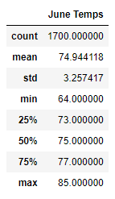
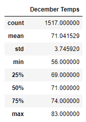

# surfs_up

## Overview of the analysis

This analysis is created to analyze the weather in Oahu, Hawaii, specifically temperature data for the months of June and December, in order to determine if the surf and ice cream shop business is sustainable there year-round.

## Results 

Comparing June and December data 

we can see that:

- The mean  temperature in June is about 75 degrees while in December it is 71 degrees, same numbers for the 50th percentile.
- The standard deviation in December is about 3.75 while in June it is about 3.26 what means that the temperature values in December are a little more spread out than in June.
- According to data of 25th and 75th percentile most of the time the temperature in June is between 73 and 77 degrees while in December it is between 74 and 69. In both cases the temperature is good for surfing.

##  Summary

The analysis shows that the temperature around the year in Oahu stays pretty much the same with minimum 64, maximum 85, average 75 degrees in June and minimum 56, maximum 83, average 71 degrees in December. Most of the time the temperature in June is between 73 and 77 degrees while in December it is between 69 and 74 which is great temperature to surf.

In order to have more detailed analysis before opening the surf shop I would gather more weather data for June and December such as precipitation data, wind speed and direction (offshore or onshore) and waves height.

